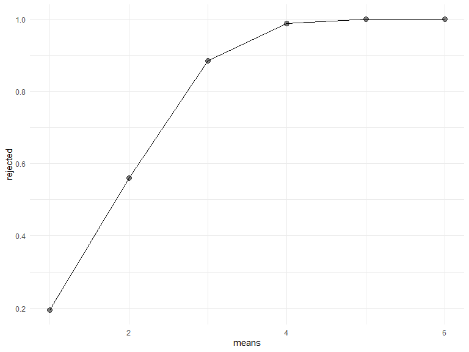
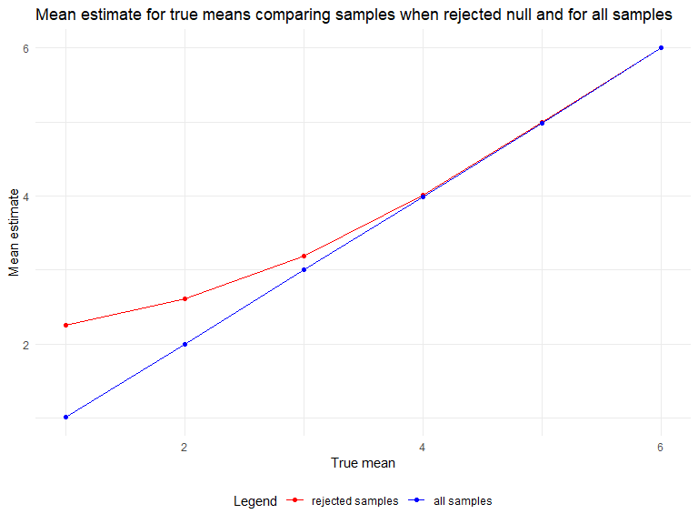

p8105_hw5_as6445
================
Ayako Sekiya
2022-11-16

## Problem 1

The code chunk below imports the data in individual spreadsheets
contained in `./data/zip_data/`. To do this, I create a dataframe that
includes the list of all files in that directory and the complete path
to each file. As a next step, I `map` over paths and import data using
the `read_csv` function. Finally, I `unnest` the result of `map`.

``` r
full_df = 
  tibble(
    files = list.files("data/zip_data/"),
    path = str_c("data/zip_data/", files)
  ) %>% 
  mutate(data = map(path, read_csv)) %>% 
  unnest()
```

    ## Rows: 1 Columns: 8
    ## ── Column specification ────────────────────────────────────────────────────────
    ## Delimiter: ","
    ## dbl (8): week_1, week_2, week_3, week_4, week_5, week_6, week_7, week_8
    ## 
    ## ℹ Use `spec()` to retrieve the full column specification for this data.
    ## ℹ Specify the column types or set `show_col_types = FALSE` to quiet this message.
    ## Rows: 1 Columns: 8
    ## ── Column specification ────────────────────────────────────────────────────────
    ## Delimiter: ","
    ## dbl (8): week_1, week_2, week_3, week_4, week_5, week_6, week_7, week_8
    ## 
    ## ℹ Use `spec()` to retrieve the full column specification for this data.
    ## ℹ Specify the column types or set `show_col_types = FALSE` to quiet this message.
    ## Rows: 1 Columns: 8
    ## ── Column specification ────────────────────────────────────────────────────────
    ## Delimiter: ","
    ## dbl (8): week_1, week_2, week_3, week_4, week_5, week_6, week_7, week_8
    ## 
    ## ℹ Use `spec()` to retrieve the full column specification for this data.
    ## ℹ Specify the column types or set `show_col_types = FALSE` to quiet this message.
    ## Rows: 1 Columns: 8
    ## ── Column specification ────────────────────────────────────────────────────────
    ## Delimiter: ","
    ## dbl (8): week_1, week_2, week_3, week_4, week_5, week_6, week_7, week_8
    ## 
    ## ℹ Use `spec()` to retrieve the full column specification for this data.
    ## ℹ Specify the column types or set `show_col_types = FALSE` to quiet this message.
    ## Rows: 1 Columns: 8
    ## ── Column specification ────────────────────────────────────────────────────────
    ## Delimiter: ","
    ## dbl (8): week_1, week_2, week_3, week_4, week_5, week_6, week_7, week_8
    ## 
    ## ℹ Use `spec()` to retrieve the full column specification for this data.
    ## ℹ Specify the column types or set `show_col_types = FALSE` to quiet this message.
    ## Rows: 1 Columns: 8
    ## ── Column specification ────────────────────────────────────────────────────────
    ## Delimiter: ","
    ## dbl (8): week_1, week_2, week_3, week_4, week_5, week_6, week_7, week_8
    ## 
    ## ℹ Use `spec()` to retrieve the full column specification for this data.
    ## ℹ Specify the column types or set `show_col_types = FALSE` to quiet this message.
    ## Rows: 1 Columns: 8
    ## ── Column specification ────────────────────────────────────────────────────────
    ## Delimiter: ","
    ## dbl (8): week_1, week_2, week_3, week_4, week_5, week_6, week_7, week_8
    ## 
    ## ℹ Use `spec()` to retrieve the full column specification for this data.
    ## ℹ Specify the column types or set `show_col_types = FALSE` to quiet this message.
    ## Rows: 1 Columns: 8
    ## ── Column specification ────────────────────────────────────────────────────────
    ## Delimiter: ","
    ## dbl (8): week_1, week_2, week_3, week_4, week_5, week_6, week_7, week_8
    ## 
    ## ℹ Use `spec()` to retrieve the full column specification for this data.
    ## ℹ Specify the column types or set `show_col_types = FALSE` to quiet this message.
    ## Rows: 1 Columns: 8
    ## ── Column specification ────────────────────────────────────────────────────────
    ## Delimiter: ","
    ## dbl (8): week_1, week_2, week_3, week_4, week_5, week_6, week_7, week_8
    ## 
    ## ℹ Use `spec()` to retrieve the full column specification for this data.
    ## ℹ Specify the column types or set `show_col_types = FALSE` to quiet this message.
    ## Rows: 1 Columns: 8
    ## ── Column specification ────────────────────────────────────────────────────────
    ## Delimiter: ","
    ## dbl (8): week_1, week_2, week_3, week_4, week_5, week_6, week_7, week_8
    ## 
    ## ℹ Use `spec()` to retrieve the full column specification for this data.
    ## ℹ Specify the column types or set `show_col_types = FALSE` to quiet this message.
    ## Rows: 1 Columns: 8
    ## ── Column specification ────────────────────────────────────────────────────────
    ## Delimiter: ","
    ## dbl (8): week_1, week_2, week_3, week_4, week_5, week_6, week_7, week_8
    ## 
    ## ℹ Use `spec()` to retrieve the full column specification for this data.
    ## ℹ Specify the column types or set `show_col_types = FALSE` to quiet this message.
    ## Rows: 1 Columns: 8
    ## ── Column specification ────────────────────────────────────────────────────────
    ## Delimiter: ","
    ## dbl (8): week_1, week_2, week_3, week_4, week_5, week_6, week_7, week_8
    ## 
    ## ℹ Use `spec()` to retrieve the full column specification for this data.
    ## ℹ Specify the column types or set `show_col_types = FALSE` to quiet this message.
    ## Rows: 1 Columns: 8
    ## ── Column specification ────────────────────────────────────────────────────────
    ## Delimiter: ","
    ## dbl (8): week_1, week_2, week_3, week_4, week_5, week_6, week_7, week_8
    ## 
    ## ℹ Use `spec()` to retrieve the full column specification for this data.
    ## ℹ Specify the column types or set `show_col_types = FALSE` to quiet this message.
    ## Rows: 1 Columns: 8
    ## ── Column specification ────────────────────────────────────────────────────────
    ## Delimiter: ","
    ## dbl (8): week_1, week_2, week_3, week_4, week_5, week_6, week_7, week_8
    ## 
    ## ℹ Use `spec()` to retrieve the full column specification for this data.
    ## ℹ Specify the column types or set `show_col_types = FALSE` to quiet this message.
    ## Rows: 1 Columns: 8
    ## ── Column specification ────────────────────────────────────────────────────────
    ## Delimiter: ","
    ## dbl (8): week_1, week_2, week_3, week_4, week_5, week_6, week_7, week_8
    ## 
    ## ℹ Use `spec()` to retrieve the full column specification for this data.
    ## ℹ Specify the column types or set `show_col_types = FALSE` to quiet this message.
    ## Rows: 1 Columns: 8
    ## ── Column specification ────────────────────────────────────────────────────────
    ## Delimiter: ","
    ## dbl (8): week_1, week_2, week_3, week_4, week_5, week_6, week_7, week_8
    ## 
    ## ℹ Use `spec()` to retrieve the full column specification for this data.
    ## ℹ Specify the column types or set `show_col_types = FALSE` to quiet this message.
    ## Rows: 1 Columns: 8
    ## ── Column specification ────────────────────────────────────────────────────────
    ## Delimiter: ","
    ## dbl (8): week_1, week_2, week_3, week_4, week_5, week_6, week_7, week_8
    ## 
    ## ℹ Use `spec()` to retrieve the full column specification for this data.
    ## ℹ Specify the column types or set `show_col_types = FALSE` to quiet this message.
    ## Rows: 1 Columns: 8
    ## ── Column specification ────────────────────────────────────────────────────────
    ## Delimiter: ","
    ## dbl (8): week_1, week_2, week_3, week_4, week_5, week_6, week_7, week_8
    ## 
    ## ℹ Use `spec()` to retrieve the full column specification for this data.
    ## ℹ Specify the column types or set `show_col_types = FALSE` to quiet this message.
    ## Rows: 1 Columns: 8
    ## ── Column specification ────────────────────────────────────────────────────────
    ## Delimiter: ","
    ## dbl (8): week_1, week_2, week_3, week_4, week_5, week_6, week_7, week_8
    ## 
    ## ℹ Use `spec()` to retrieve the full column specification for this data.
    ## ℹ Specify the column types or set `show_col_types = FALSE` to quiet this message.
    ## Rows: 1 Columns: 8
    ## ── Column specification ────────────────────────────────────────────────────────
    ## Delimiter: ","
    ## dbl (8): week_1, week_2, week_3, week_4, week_5, week_6, week_7, week_8
    ## 
    ## ℹ Use `spec()` to retrieve the full column specification for this data.
    ## ℹ Specify the column types or set `show_col_types = FALSE` to quiet this message.

The result of the previous code chunk isn’t tidy – data are wide rather
than long, and some important variables are included as parts of others.
The code chunk below tides the data using string manipulations on the
file, converting from wide to long, and selecting relevant variables.

``` r
tidy_df = 
  full_df %>% 
  mutate(
    files = str_replace(files, ".csv", ""),
    group = str_sub(files, 1, 3)) %>% 
  pivot_longer(
    week_1:week_8,
    names_to = "week",
    values_to = "outcome",
    names_prefix = "week_") %>% 
  mutate(week = as.numeric(week)) %>% 
  select(group, subj = files, week, outcome)
```

Finally, the code chunk below creates a plot showing individual data,
faceted by group.

``` r
tidy_df %>% 
  ggplot(aes(x = week, y = outcome, group = subj, color = group)) + 
  geom_point() + 
  geom_path() + 
  facet_grid(~group)
```


This plot suggests high within-subject correlation – subjects who start
above average end up above average, and those that start below average
end up below average. Subjects in the control group generally don’t
change over time, but those in the experiment group increase their
outcome in a roughly linear way.

## Problem 2

``` r
homicide = 
  read_csv(file = "./data/homicide-data.csv")
```

    ## Rows: 52179 Columns: 12
    ## ── Column specification ────────────────────────────────────────────────────────
    ## Delimiter: ","
    ## chr (9): uid, victim_last, victim_first, victim_race, victim_age, victim_sex...
    ## dbl (3): reported_date, lat, lon
    ## 
    ## ℹ Use `spec()` to retrieve the full column specification for this data.
    ## ℹ Specify the column types or set `show_col_types = FALSE` to quiet this message.

There are 52179 observations and 12 columns in the homicide data. The
variables included are as following: uid, reported_date, victim_last,
victim_first, victim_race, victim_age, victim_sex, city, state, lat,
lon, disposition.

Create a city_state variable (e.g. “Baltimore, MD”) and then summarize
within cities to obtain the total number of homicides and the number of
unsolved homicides (those for which the disposition is “Closed without
arrest” or “Open/No arrest”).

I summarized the count by using `group_by()` and `count()`.

``` r
homicide_data= homicide %>% 
  unite("city_state", city:state, remove = FALSE, sep=", ") %>% 
  group_by(city_state) %>% 
  count(disposition, name = "disp_count") %>% 
  pivot_wider(
    names_from= "disposition",
    values_from= "disp_count")%>% 
  janitor::clean_names() %>% 
  replace(is.na(.), 0) %>% 
  mutate(total=closed_by_arrest + open_no_arrest +closed_without_arrest,
        unsolved= closed_without_arrest +open_no_arrest)
```

For the city of Baltimore, MD, use the `prop.test` function to estimate
the proportion of homicides that are unsolved; save the output of
prop.test as an R object, apply the broom::tidy to this object and pull
the estimated proportion and confidence intervals from the resulting
tidy dataframe.

``` r
prop.test(
  homicide_data %>%  filter(city_state == "Baltimore, MD") %>% pull(unsolved),
   homicide_data %>%  filter(city_state == "Baltimore, MD") %>% pull(total)) %>% 
  broom::tidy()
```

    ## # A tibble: 1 × 8
    ##   estimate statistic  p.value parameter conf.low conf.high method        alter…¹
    ##      <dbl>     <dbl>    <dbl>     <int>    <dbl>     <dbl> <chr>         <chr>  
    ## 1    0.646      239. 6.46e-54         1    0.628     0.663 1-sample pro… two.si…
    ## # … with abbreviated variable name ¹​alternative

Now run prop.test for each of the cities in your dataset, and extract
both the proportion of unsolved homicides and the confidence interval
for each. Do this within a “tidy” pipeline, making use of purrr::map,
purrr::map2, list columns and unnest as necessary to create a tidy
dataframe with estimated proportions and CIs for each city.

``` r
homicide_prop = homicide_data %>% 
  mutate(
    proportions = map2(.x = unsolved, .y = total, ~prop.test(x = .x, n = .y)),
    tidied = map(.x = proportions, ~broom::tidy(.x))
  ) %>% 
  select(-proportions) %>% 
  unnest(tidied) %>% 
  select(city_state, estimate, conf.low,conf.high)
```

Create a plot that shows the estimates and CIs for each city – check out
geom_errorbar for a way to add error bars based on the upper and lower
limits. Organize cities according to the proportion of unsolved
homicides.

``` r
homicide_plot= homicide_prop %>% 
  ggplot(aes(x = fct_reorder(city_state, estimate), y = estimate)) + 
  geom_point() +  
  geom_errorbar(aes(ymin = conf.low, ymax = conf.high)) +
  theme(axis.text.x = element_text(angle = 90, vjust = 0.5, hjust = 1))

ggsave(path = "results", "homicide_plot.pdf")
```

    ## Saving 8 x 6 in image

## Problem 3

First set the following design elements:

Fix n=30 Fix σ=5

Set μ=0.

#### Create Simulation

``` r
simulations = function(mu=0, n=30, sigma = 5) {
  
  sim_data = tibble(
    x = rnorm(n , mean=mu, sd = sigma),
  )
  
    t.test(sim_data) %>%
    broom::tidy() %>%
    select(estimate,p.value)
}
```

Generate 5000 datasets from the model:

``` r
expand_grid(
  means = 0,
  iteration = 1:5000
) %>%
  mutate(
    estimate_df = map(means, simulations)
  ) %>%
  unnest(estimate_df)
```

    ## # A tibble: 5,000 × 4
    ##    means iteration estimate p.value
    ##    <dbl>     <int>    <dbl>   <dbl>
    ##  1     0         1    1.27   0.151 
    ##  2     0         2    0.124  0.915 
    ##  3     0         3   -0.852  0.313 
    ##  4     0         4    1.63   0.0619
    ##  5     0         5    0.468  0.619 
    ##  6     0         6    2.03   0.0399
    ##  7     0         7   -0.855  0.475 
    ##  8     0         8   -0.649  0.492 
    ##  9     0         9   -0.131  0.872 
    ## 10     0        10    0.104  0.925 
    ## # … with 4,990 more rows

Simulate for μ={1,2,3,4,5,6}:

``` r
sim_results_df = 
  expand_grid(
    means = c(1:6),
    iteration = 1:5000
  ) %>% 
  mutate(
    estimate_df = map(means, simulations)
  ) %>%
  unnest(estimate_df)
```

#### Create first plot

Make a plot showing the proportion of times the null was rejected (the
power of the test) on the y axis and the true value of μ on the x axis.
Describe the association between effect size and power.

``` r
plot1 = 
  sim_results_df %>%
  group_by(means) %>%
  summarize(
    rejected = sum(p.value < 0.05, na.rm = TRUE)/5000
  ) %>%
  ggplot(aes(x = means, y = rejected)) + 
    geom_point(alpha = .5, size = 3) + 
    geom_line()
  labs(
    title = "Power of t-test for true mean value",
    x = "True mean",
    y = "Power"
  )
```

    ## $x
    ## [1] "True mean"
    ## 
    ## $y
    ## [1] "Power"
    ## 
    ## $title
    ## [1] "Power of t-test for true mean value"
    ## 
    ## attr(,"class")
    ## [1] "labels"

``` r
plot1
```



``` r
ggsave("results/plot1.pdf", plot1, width = 20, height = 10)
```

When the effect size increases, power also increases.

#### Create some more plots!

Make a plot showing the average estimate of μ on the y axis and the true
value of μ on the x axis. Make a second plot (or overlay on the first)
the average estimate of μ only in samples for which the null was
rejected on the y axis and the true value of μ on the x axis.

``` r
estimateplot=
  sim_results_df %>%
  group_by(means)%>%
    summarize(estimate_mean=mean(estimate))
```

``` r
overlay = 
  sim_results_df %>%
  filter(p.value < 0.05) %>%
  group_by(means) %>%
  summarize(
    estimate_mean = mean(estimate)
  ) %>%
  ggplot(aes(x = means, y = estimate_mean, color = "rejected samples")) + 
  geom_point() +
  geom_line() +
  geom_point(data = estimateplot, aes(color = "all samples")) +
  geom_line(data = estimateplot, aes(color = "all samples")) +
  scale_color_manual(
    name = "Legend",
    breaks = c("rejected samples", "all samples"),
    values = c("rejected samples" = "red", "all samples" = "blue")) +
  labs(
    title = "Mean estimate for true means comparing samples when rejected null and for all samples",
    x = "True mean",
    y = "Mean estimate",
  )

overlay
```



``` r
ggsave("results/overlayplot.pdf", overlay, width = 20, height = 10)
```

Based on the plot, when the true mu is 0, the estimate mu of rejecting
the null are greater than the true value of mu. When the true value of
mu increases, the averages of mu when the null is rejected gets closer
to the true mu until the true value of mu is 4. After this point, the
averages of mu rejecting the null and the true value of mu are very
close together.

When mu=1 the effect size is really small and power will also be small,
so we will less likely have estimates that reject the null. As mu
increases, effect size also increases, so we will be more likely to
reject the null.
